# Flujo de Deploy — SWARD

## Diagrama completo

```mermaid
flowchart TD
    %% ─── DEVELOPER ───────────────────────────────────────────
    DEV([👨‍💻 Developer])

    DEV -->|git push main| CI_TEST
    DEV -->|git push deploy| CD_BUILD

    %% ─── CI: TESTS SOLO ──────────────────────────────────────
    subgraph CI ["⚙️ CI — Rama main (tests)"]
        CI_TEST[lint + ruff]
        CI_TEST --> CI_PYTEST[pytest]
        CI_PYTEST --> CI_BANDIT[bandit + pip-audit\nmicroservicios]
        CI_BANDIT --> CI_OK[✅ OK]
    end

    %% ─── CD: BUILD + PUSH + DEPLOY ──────────────────────────
    subgraph CD ["🚀 CD — Rama deploy (build + push + deploy)"]
        CD_BUILD[lint + tests]
        CD_BUILD --> CD_DOCKER[docker build]
        CD_DOCKER --> CD_PUSH[push GHCR\nghcr.io/sward-upc/IMAGE:timestamp]

        CD_PUSH --> CD_FLAG{SEND_TO_AWS\n= true?}

        CD_FLAG -->|No| CD_STOP[✅ imagen publicada\nsin deploy a AWS]

        CD_FLAG -->|Sí — microservicio| CD_ECS[aws ecs update-service\n--force-new-deployment]
        CD_FLAG -->|Sí — lambda| CD_LAMBDA[aws lambda update-function-code\n--image-uri]

        CD_ECS --> CD_ROLLING[ECS Rolling Update\nsin downtime]
        CD_LAMBDA --> CD_INSTANT[Lambda activa\ninstantáneamente]
    end

    %% ─── CDK INFRA ───────────────────────────────────────────
    subgraph CDK ["🏗️ CDK Deploy — Rama deploy (sward-infra)"]
        CDK_DIFF[cdk synth\ncdk diff --all]
        CDK_DIFF --> CDK_APPROVAL{⏸ Aprobación\nmanual}
        CDK_APPROVAL -->|Rechazado| CDK_ABORT[❌ Cancelado]
        CDK_APPROVAL -->|Aprobado| CDK_DEPLOY[cdk deploy --all]

        CDK_DEPLOY --> STK1[SwardNetworking\nVPC · Subnets · SGs]
        CDK_DEPLOY --> STK2[SwardEcr\n6 repos imágenes]
        CDK_DEPLOY --> STK3[SwardSecrets\nJWT · Service Keys]
        CDK_DEPLOY --> STK4[SwardStorage\nS3 recursos]
        CDK_DEPLOY --> STK5[SwardDatabase\n6 RDS PostgreSQL]
        CDK_DEPLOY --> STK6[SwardCache\nElastiCache Redis]
        CDK_DEPLOY --> STK7[SwardServices\nECS Fargate · ALB]
        CDK_DEPLOY --> STK8[SwardLambdas\n4 Lambdas · EventBridge · SQS]
    end

    DEV -->|git push deploy\nsward-infra| CDK_DIFF

    %% ─── AWS RUNTIME ─────────────────────────────────────────
    subgraph AWS ["☁️ AWS Runtime"]
        ALB[ALB\nLoad Balancer]

        subgraph ECS ["ECS Fargate"]
            MS1[sward-ms-usuarios\n:8001]
            MS2[sward-ms-integracion-lms\n:8002]
            MS3[sward-ms-trazabilidad\n:8003]
            MS4[sward-ms-cursos-recursos\n:8004]
            MS5[sward-ms-recomendacion\n:8005]
            MS6[sward-ms-xai\n:8006]
        end

        subgraph LAMBDAS ["Lambdas"]
            L1[moodle-sync\nEventBridge 15min]
            L2[interacciones\nSQS]
            L3[alertas\nEventBridge]
            L4[recursos\nS3 ObjectCreated]
        end

        subgraph DATA ["Datos"]
            RDS[(6x RDS\nPostgreSQL)]
            REDIS[(ElastiCache\nRedis)]
            S3[(S3\nRecursos)]
        end

        ALB --> MS1 & MS2 & MS3 & MS4 & MS5 & MS6
        MS1 & MS2 & MS3 & MS4 & MS5 & MS6 --> RDS
        MS1 & MS6 --> REDIS
        L4 --> S3
    end

    CD_ROLLING --> ECS
    CD_INSTANT --> LAMBDAS
    CDK_DEPLOY -.->|crea/actualiza| AWS

    %% ─── ESTILOS ──────────────────────────────────────────────
    classDef ciBox fill:#1a1a2e,stroke:#4a9eff,color:#fff
    classDef cdBox fill:#0d2137,stroke:#00d4aa,color:#fff
    classDef cdkBox fill:#1a0d37,stroke:#ff6b6b,color:#fff
    classDef awsBox fill:#0d1f0d,stroke:#ff9900,color:#fff
    classDef flag fill:#2d2d00,stroke:#ffdd00,color:#fff

    class CI_TEST,CI_PYTEST,CI_BANDIT,CI_OK ciBox
    class CD_BUILD,CD_DOCKER,CD_PUSH,CD_ECS,CD_LAMBDA,CD_ROLLING,CD_INSTANT,CD_STOP cdBox
    class CDK_DIFF,CDK_DEPLOY,STK1,STK2,STK3,STK4,STK5,STK6,STK7,STK8 cdkBox
    class ALB,MS1,MS2,MS3,MS4,MS5,MS6,L1,L2,L3,L4,RDS,REDIS,S3 awsBox
    class CD_FLAG,CDK_APPROVAL flag
```



## Reglas de oro

| Situación | Acción |
|-----------|--------|
| Cambié código de un microservicio | `git push origin deploy` en ese repo |
| Cambié código de una lambda | `git push origin deploy` en ese repo |
| Nueva BD, nuevo servicio, nueva regla de red | `git push origin deploy` en `sward-infra` → aprobar |
| Quiero ver el estado de la infra sin cambiar nada | `cdk diff --all` local |
| Activar deploy automático a AWS | Cambiar secret `SEND_TO_AWS` a `true` en org GitHub |

## Stacks CDK — orden de dependencias

```
SwardNetworking
    ├── SwardDatabase   (necesita VPC)
    ├── SwardCache      (necesita VPC)
    └── SwardServices   (necesita VPC + DB + Cache + ECR + Secrets)
            └── SwardLambdas  (necesita VPC, S3 notifica a lambda-recursos)

SwardEcr        (independiente)
SwardSecrets    (independiente)
SwardStorage    (independiente → S3 notifica a SwardLambdas)
```

## Variables de entorno requeridas (GitHub Secrets — org level)

| Secret | Valor | Cuándo se usa |
|--------|-------|---------------|
| `AWS_ACCESS_KEY_ID` | Key IAM | CD deploy + CDK deploy |
| `AWS_SECRET_ACCESS_KEY` | Secret IAM | CD deploy + CDK deploy |
| `AWS_REGION` | `us-east-1` | CD deploy + CDK deploy |
| `SEND_TO_AWS` | `false` → `true` para activar | CD deploy |
